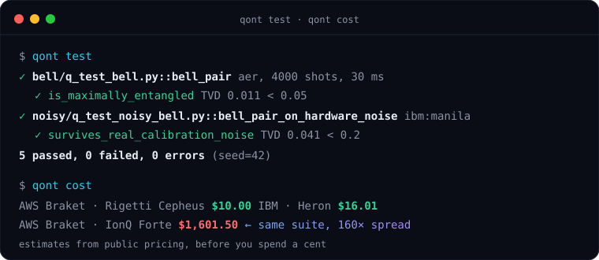

# Qontinuum

[](https://pypi.org/project/qontinuum/)
[](https://github.com/XTanishkX/quantum/actions/workflows/ci.yml)
[](https://pypi.org/project/qontinuum/)
[](LICENSE)

**The Quantum Engineering Platform — statistical testing, cost & execution intelligence, provider-agnostic plugins, and observability for quantum programs.**

🌐 **[Website](https://xtanishkx.github.io/quantum/)** · 📚 **[Docs](https://xtanishkx.github.io/quantum/docs/)** · 📊 **[Live demo dashboard](https://xtanishkx.github.io/quantum/demo/dashboard.html)** · 📖 **[Explainer](EXPLAINER.md)**

<p align="center"></p>

Quantum programs don't return values — they return probability distributions sampled from
noisy hardware. `assert result == expected` doesn't work, and nothing in the classical CI
toolchain knows that. Qontinuum does.

- **`qont test`** — a pytest-style runner for quantum circuits with *statistical* assertions:
  total variation distance with shots-aware soundness floors, chi-squared tests, Hellinger
  fidelity, and snapshot baselines committed as JSON.
- **`qont cost`** — estimates what your suite would cost on real hardware across providers
  (IonQ, Rigetti, IQM, AQT via Braket; IBM; Azure Quantum) before you spend a cent.
- **`qont route`** — recommends hardware for your workload: estimated success probability ×
  price, ranked by `--optimize cost|fidelity|value`.
- **`qont recommend` / `plan` / `health`** — *execution intelligence*: rank devices under six
  strategies with a plain-English explanation of every choice, produce a concrete execution
  plan with fallbacks, and score per-device reliability from calibration + your run history.
- **`qont run --on ibm:… --max-cost 5`** — executes the suite on *real* hardware behind an
  all-or-nothing spend guard (default budget: $0 — it refuses until you authorize).
- **`qont ci`** — one command for CI: run the suite, write a markdown report.
- **`qont dashboard`** — renders run history as a self-contained HTML observability
  dashboard (status timeline, per-check statistic trends vs thresholds).
- **`qont diff` / `qont hash`** — semantic, register-name-agnostic circuit diffing and
  content addressing.
- **GitHub Action** — posts a sticky PR comment with regression results and the cost table.
- **Noise-aware testing** — simulate against real IBM device calibration data, offline,
  for free.
- **Plugin ecosystem** — providers, simulator backends, and SDKs are plugins; Qiskit, QASM
  2/3, Cirq, PennyLane, IBM, and Braket ship built in, and you can add your own via entry
  points without forking.

…and that's just the core. **v0.5 (public beta) is the Quantum Engineering Platform — [124 commands](https://xtanishkx.github.io/quantum/docs/commands/)** translating the DevOps stack to quantum:

| | |
|---|---|
| `qont lint` | **ruff for quantum tests** — 9 rules incl. the statistical soundness floor (Q001) |
| `qont noise headroom` | **load-testing for quantum** — how much calibration drift survives your test? |
| `qont history bisect` | **git-bisect for physics** — which run first crossed the threshold? |
| `qont budget` | **QPU FinOps** — monthly/total caps enforced *before* submission |
| `qont test --cached` | **build caching for simulation** — content-addressed seeded results |
| `qont fuzz` | **flakiness hunting** — empirical pass rates with Wilson intervals |
| `qont pack` | **reproducibility bundles** — `verify` re-runs and two-sample-compares |
| `qont shots plan` | **shot-count audits** — the napkin statistics, mechanized |
| `qont report junit` | quantum checks rendered natively in Jenkins/GitLab/Buildkite |
| `qont explain` | failure forensics: which outcomes drove the statistic, and why |
| `qont recommend` / `plan` / `health` | **execution intelligence** — [reason about where to run](https://xtanishkx.github.io/quantum/docs/execution-intelligence/): fidelity, cost, speed, reliability, with explanations |
| `qont report engineering` | one **engineering report** — recommendation, execution plan (risk + confidence), provider & cost analysis, history |
| `qont telemetry` | **opt-in [Quantum Intelligence Network](https://xtanishkx.github.io/quantum/docs/intelligence-network/)** — anonymous, [privacy-first](https://xtanishkx.github.io/quantum/docs/privacy/) community intelligence, off by default |
| `qont plugin` | **provider-, backend-, and SDK-agnostic** — add hardware or SDKs via [plugins](https://xtanishkx.github.io/quantum/docs/plugins/), no fork |
| + `circuit` `device` `registry` `stats` `bench` `watch` `config` `env` `doctor` `init` `mock` `schedule` … | the full plumbing |


## Install

```sh
pip install qontinuum          # core
pip install 'qontinuum[ibm]'   # + IBM calibration noise models
```

## Quick start

Write a quantum test in any file named `q_test_*.py`:

```python
from qiskit import QuantumCircuit
from qontinuum import qtest, assert_distribution

@qtest(shots=4000)
def bell_pair():
    qc = QuantumCircuit(2)
    qc.h(0)
    qc.cx(0, 1)
    qc.measure_all()
    return qc

@bell_pair.check
def is_maximally_entangled(result):
    assert_distribution(result, {"00": 0.5, "11": 0.5}, tvd_threshold=0.05)
```

```text
$ qont test
✓ q_test_bell.py::bell_pair  aer, 4000 shots, 30 ms
    ✓ is_maximally_entangled

1 passed, 0 failed, 0 errors
```

### Statistics done right

Sampling noise means even a perfect circuit never reproduces a distribution exactly.
Every assertion is shots-aware: if your threshold is below what the shot count can
statistically resolve, Qontinuum refuses to run a test that would be flaky by
construction — and tells you the shot count that would fix it:

```text
! is_maximally_entangled  tvd_threshold=0.01 is below the sampling noise floor 0.0289
  at 4000 shots: even a perfect result would fail ~1% of the time.
  Use at least 33380 shots or raise the threshold to >= 0.0289.
```

### Test against real hardware noise — offline and free

```python
@qtest(shots=4000, backend="ibm:manila")   # bundled real calibration snapshot
def bell_under_noise(): ...

@qtest(shots=4000, backend="ibm:brisbane@live")  # today's live calibration (free IBM account)
def bell_today(): ...
```

### Snapshot testing for quantum

```python
@qtest(shots=4000, snapshot=True)
def ghz_5(): ...
```

`qont snapshot update` records the distribution as a golden baseline (keyed by the
circuit's content hash). Later runs are compared with a two-sample homogeneity test —
if the circuit changes, the snapshot is flagged stale for review, exactly like Jest.

### Know the cost before you run on hardware

```text
$ qont cost
             Estimated hardware cost — 3 test(s), 12000 total shots
┃ Provider      ┃ Device                ┃ Est. cost ┃
│ AWS Braket    │ Rigetti Cepheus       │     $6.00 │
│ IBM Quantum   │ Heron (Pay-As-You-Go) │     $9.61 │
│ AWS Braket    │ IQM Garnet            │    $18.30 │
│ Azure Quantum │ IonQ Aria 1           │    $63.29 │
│ AWS Braket    │ IonQ Forte            │   $960.90 │
│ Azure Quantum │ Quantinuum H2         │ 137.4 HQC │
```

Same suite, **$6 or $961**, depending on where you run it. That's why this table
belongs on every pull request.

### Route to the right hardware

```text
$ qont route --optimize value
┃ # ┃ Provider    ┃ Device          ┃ Est. success/shot ┃ Est. cost ┃ $ / success ┃
│ 1 │ AWS Braket  │ Rigetti Cepheus │             71.0% │    $10.00 │      $14.08 │
│ 2 │ IBM Quantum │ Heron (PAYG)    │             93.3% │    $16.01 │      $17.17 │
```

Cheap-but-noisy vs pricey-but-clean, resolved with one number.

### Run on real hardware — without surprise bills

```sh
qont run --on ibm:ibm_brisbane --dry-run --max-cost 5    # estimate only
qont run --on braket:rigetti_cepheus --max-cost 5        # refuses if estimate > $5
```

The guard is all-or-nothing: the whole suite is priced *before* the first shot is
submitted, and the default budget is $0.

### Watch your suite over time

Every run appends to `.qontinuum/history.jsonl`; `qont dashboard` turns it into a
single-file HTML dashboard — status timeline, each check's statistic trending against
its threshold, cost per run. No server, no JavaScript, works as a CI artifact.

### Diff circuits, not files

```text
$ qont diff old.qasm new.qasm
- cx q[0, 1]
+ cx q[1, 0]
1 ops added, 1 removed
```

Register renames and formatting don't show up — only semantic changes do (the same
canonicalization that powers snapshot staleness detection).

## GitHub Action

```yaml
# .github/workflows/quantum.yml
on: pull_request
permissions:
  contents: read
  pull-requests: write
jobs:
  quantum:
    runs-on: ubuntu-latest
    steps:
      - uses: actions/checkout@v4
      - uses: XTanishkX/quantum/action@main
        with:
          path: .
          seed: "42"
```

Every PR gets one sticky comment (updated in place) with pass/fail per check and the
hardware cost table — [see a live one on PR #1](https://github.com/XTanishkX/quantum/pull/1).

## Assertions

| Assertion | What it tests |
|---|---|
| `assert_distribution(result, expected, tvd_threshold=)` | TVD against an expected distribution, with sampling-floor soundness check |
| `assert_chi_squared(result, expected, alpha=)` | Pearson goodness-of-fit |
| `assert_fidelity(result, expected, min_fidelity=)` | Hellinger (classical) fidelity |
| `assert_probability(result, outcome, min_p=, max_p=)` | Single-outcome probability bounds |
| `assert_matches_baseline(result, counts, alpha=)` | Two-sample test vs a recorded run |

## License

Apache-2.0
